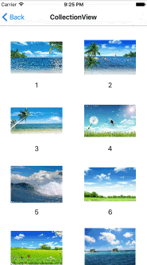
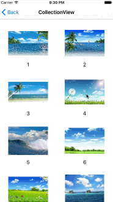

# CPImageViewer

Viewing a single image using transition animation. Supporting presentation and push &  pop.

## Screenshot

#####Present & Dismiss




#####Push & Pop



## Installation

### Manually

The simplest way to install this library is to copy `Classes/*.swift` to your project.

### CocoaPods

You can also install this library using CocoaPods. Just add this line to your Podfile:

``` ruby
pod 'CPImageViewer'
```

Then import library module like so:

``` swift
import CPImageViewer
```


## Properties

These properties is global and applied to the whole project.

``` swift
/// The viewer style. Defaults to Presentation
public var viewerStyle = CPImageViewerStyle.Presentation

/// The image of animation image view
public var image: UIImage?

/// The title of *navigationItem.rightBarButtonItem* when viewerStyle is Push
public var rightBarItemTitle: String?

/// The image of *navigationItem.rightBarButtonItem* when viewerStyle is Push
public var rightBarItemImage: UIImage?

/// The action of *navigationItem.rightBarButtonItem* when viewerStyle is Push
public var rightAction: ((Void) -> (Void))?
```


## Usage

Conforming to  *ImageControllerProtocol* protocol
``` swift
class ViewController: UIViewController, ImageControllerProtocol {
  var animationImageView: UIImageView!
  var imageViewer = ImageViewerAnimator()
}
```

Presentation

``` swift
let controller = ImageViewerViewController()
controller.transitioningDelegate = imageViewer
controller.image = animationImageView.image 
self.presentViewController(controller, animated: true, completion: nil)
```

or Push

``` swift
override func viewDidLoad() {
    self.navigationController?.delegate = imageViewer
}

controller.viewerStyle = .Push
controller.title = "CPImageViewer"
self.navigationController?.pushViewController(controller, animated: true)
```


## Requirements

* Swift 2.2
* Xcode 7.3
* iOS 8+


## License

Released under the MIT license. See LICENSE for details.